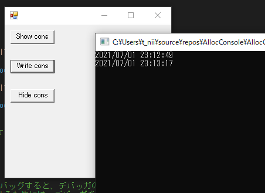

# C#(Windows Formアプリケーション)でコンソールの表示、非表示、出力方法

## 前書き

アプリケーション作っていると、デバッガからしか使えないDebug.WriteLine()ではなく、コンソールに表示したいと思う時があります。
・Formアプリケーションでコンソールウィンドウを表示して、ログ出力の代わりにしたい
・常に出しておきたいわけではないので、コンソールウィンドウの表示、非表示を切り替えたい

Trace.WriteLine() + [DebugView](https://docs.microsoft.com/en-us/sysinternals/downloads/debugview) という方法もありますが、別ツールが不要というあたりが利点です。




## 注意点

デバッガから実行すると、Console.Write()の出力がデバッガ「出力」ウィンドウにリダイレクトされてしまうのでご注意ください。
(コンソールに出力されないなーと小一時間悩んでしまいました)

## ソース

フォームにボタンを3つ配置し、コンソール表示、出力、コンソール非表示を行います。
短いソースですので、説明はインラインのコメントをご確認ください。(フォーム生成もMain()メソッドでやっています)

```C#
using System;
using System.Drawing;
using System.IO;
using System.Runtime.InteropServices;
using System.Windows.Forms;

namespace AllocConsole
{
    static class Program
    {
        [DllImport("kernel32.dll")]
        private static extern bool AllocConsole();

        [DllImport("kernel32.dll")]
        private static extern bool FreeConsole();

        /// <summary>
        /// Windows FormアプリケーションでConsoleを利用する最低限のサンプル
        /// </summary>
        [STAThread]
        static void Main()
        {
            // VisualStudioでデバッグすると、デバッガの「出力」にリダイレクトされることに注意
            // Consoleに出力させるためには、デバッガを利用せずに起動すること。

            // コンソール表示ボタン
            var btnShow = new Button() { Location = new Point(10, 10), Text = "Show cons" };
            btnShow.Click += (sender, e) =>
            {
                // Console表示
                AllocConsole();
                // コンソールとstdoutの紐づけを行う。無くても初回は出力できるが、表示、非表示を繰り返すとエラーになる。
                Console.SetOut(new StreamWriter(Console.OpenStandardOutput()) { AutoFlush = true });
            };

            // コンソール出力ボタン
            var btnWrite = new Button() { Location = new Point(10, 60), Text = "Write cons" };
            btnWrite.Click += (sender, e) => Console.WriteLine(DateTime.Now);
            // コンソール非表示ボタン
            var btnHide = new Button() { Location = new Point(10, 110), Text = "Hide cons" };
            btnHide.Click += (sender, e) => FreeConsole();

            // フォームに表示
            var form1 = new Form();
            form1.Controls.Add(btnShow);
            form1.Controls.Add(btnWrite);
            form1.Controls.Add(btnHide);

            Application.Run(form1);
        }
    }
}
```